<h1></h1>

# Student Reporting System (SRS)

A local desktop application for organizing adult ESOL student records, attendance, assessment data, lesson-planning materials, and reporting across multiple instructional sites.

## Overview

The **Student Reporting System (SRS)** was developed by **Phil Hoffert** to address the practical data-management needs of a multi-site adult ESOL program. Its original purpose was to organize records for several Cuyahoga County Public Library instructional sites serving hundreds of students.

SRS brings together information that might otherwise be scattered across paper attendance sheets, spreadsheets, testing forms, lesson-plan documents, and individual student files. It provides a central, local system for managing student demographics, site enrollment, attendance, individualized learning plans, meetings, testing, lesson planning, and program reporting.

> **Privacy notice:** This project was built for educational records that may contain personally identifiable information. Never upload production databases, student records, completed forms, screenshots, or exports containing real student information to a public repository.

## Features

### Student Records

- Create, view, edit, sort, and filter student records.
- Store demographics and contact details, including:
  - Name
  - Date of birth
  - Gender
  - Phone numbers and email
  - Address
  - Country and language background
  - Orientation date
  - LACES ID
- Assign students to one or more instructional sites.
- View a student's most recent attendance activity.

### Attendance

- Record attendance by date and instructional site.
- Review attendance history for individual students.
- Filter and sort attendance records.
- Track attendance across multiple locations from one application.

### Individual Learning Plans and Meetings

- Record student goals, including employment, college, citizenship, and language-development goals.
- Document barriers to attendance and participation, such as transportation, childcare, scheduling conflicts, and relocation.
- Track learning preferences and student notes.
- Maintain records of student meetings and progress discussions.

### Testing and Assessment

- Record assessment information, including:
  - Test date, level, and form
  - Reading and writing raw scores
  - Scaled scores
  - NRS levels
  - Combined scores
  - Measurable Skill Gain (MSG) status
- Support testing workflows across multiple sites.
- Grade assessment answer sheets and record results.
- Generate student testing and progress documentation from PDF templates.

### Lesson Planning and Class Notes

- Store searchable class notes and instructional to-do items.
- Create and open lesson plans.
- Select and document Ohio ESOL standards across receptive, productive, and interactive language domains.
- Produce structured lesson-plan documents for instructional use.

### Statistics and Reporting

- Review attendance and testing data by site and date range.
- Visualize attendance patterns across selected instructional sites.
- Support program monitoring, student follow-up, and reporting workflows.
- Reduce the need to manually combine records from multiple spreadsheets.

## Screenshots

The screenshots below use anonymized demonstration data. Each image is displayed directly from the repository and can be clicked to open its full-size file.

<details open>
<summary><strong>Student records and attendance</strong></summary>

[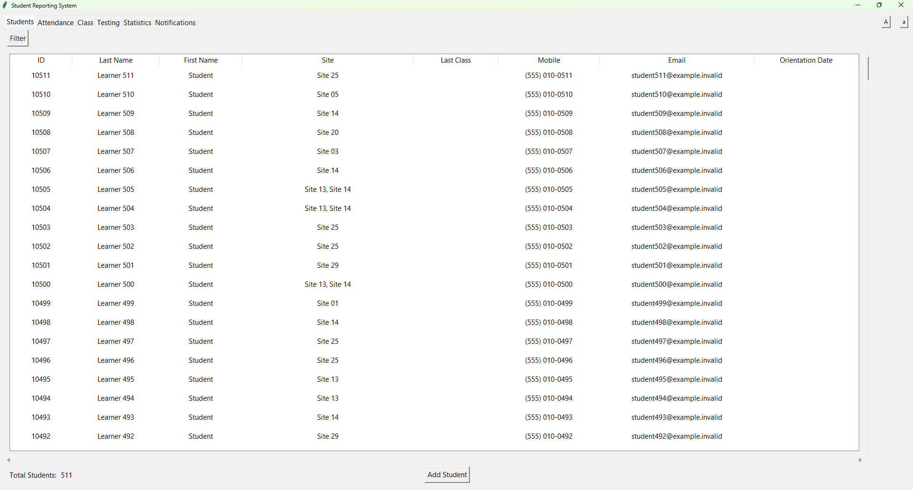](design/pngs/SRS_example_screenshots/SRS_student_main.png)

*Student-record dashboard with multi-site enrollment, contact details, and filtering.*

[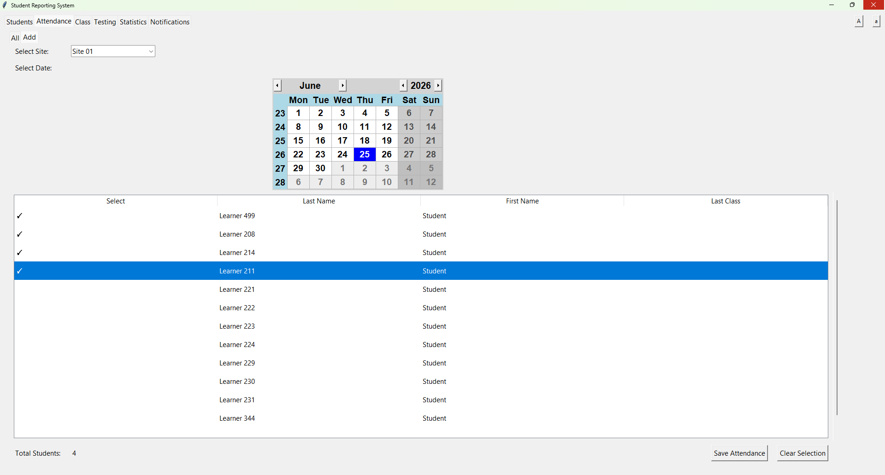](design/pngs/SRS_example_screenshots/SRS_attendance_add.png)

*Attendance entry workflow: choose a site and date, select students, then save attendance.*

[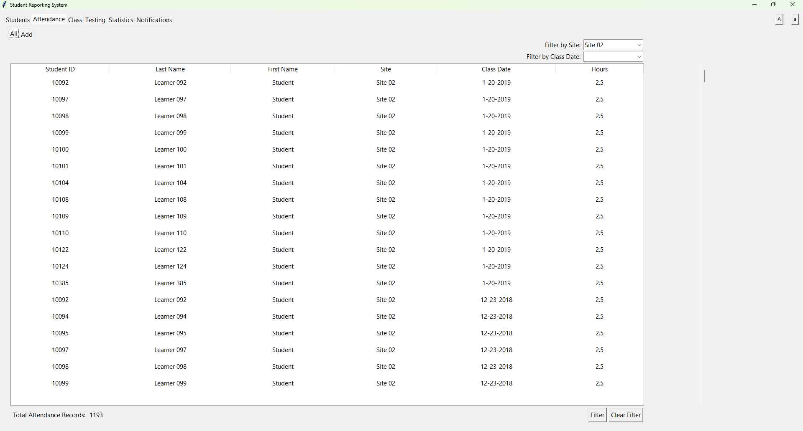](design/pngs/SRS_example_screenshots/SRS_attendance_main.png)

*Attendance history view with site and class-date filters.*

</details>

<details>
<summary><strong>Testing, assessment, and reporting</strong></summary>

[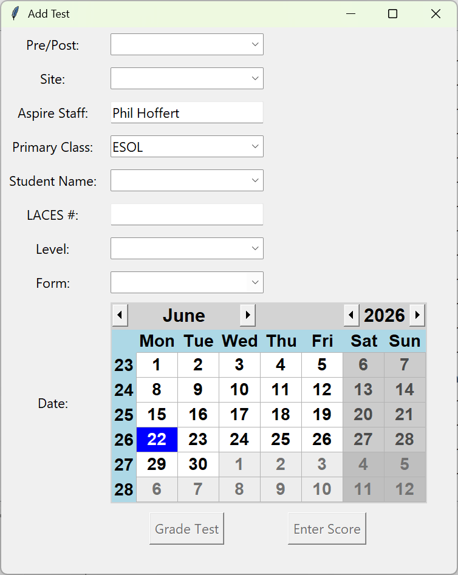](design/pngs/SRS_example_screenshots/add_test.png)

*Test-entry dialog for recording assessment information.*

[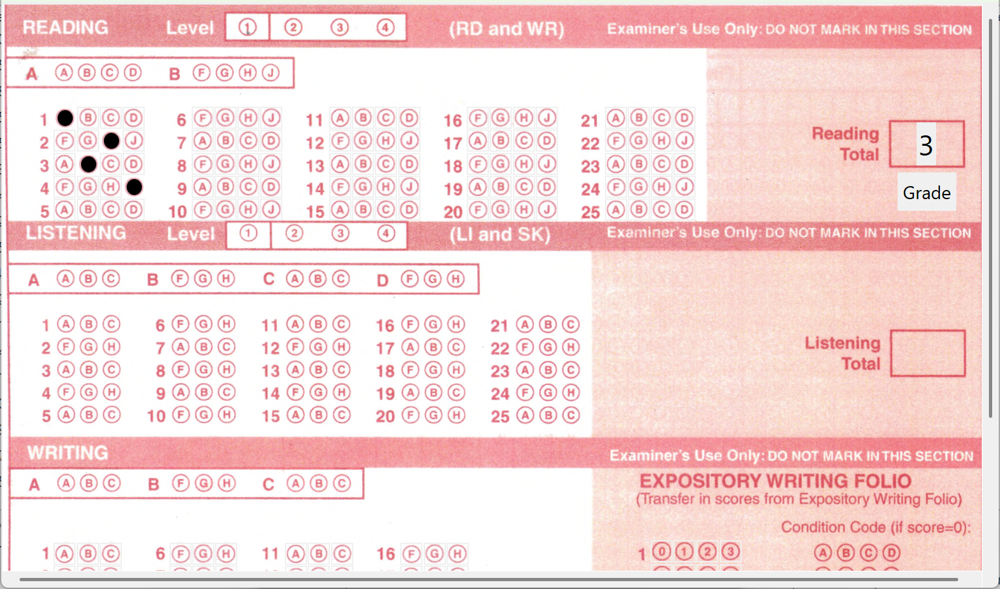](design/pngs/SRS_example_screenshots/grade_test.png)

*Integrated answer-sheet grading workflow.*

[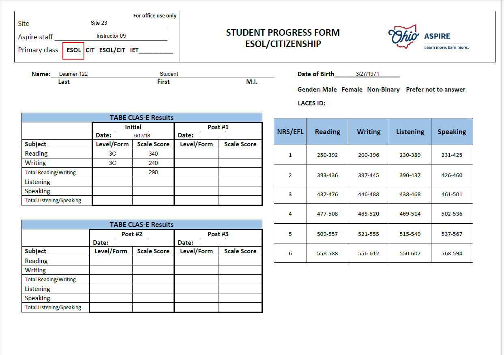](design/pngs/SRS_example_screenshots/progress_form.png)

*Generated student progress form populated from stored testing data.*

[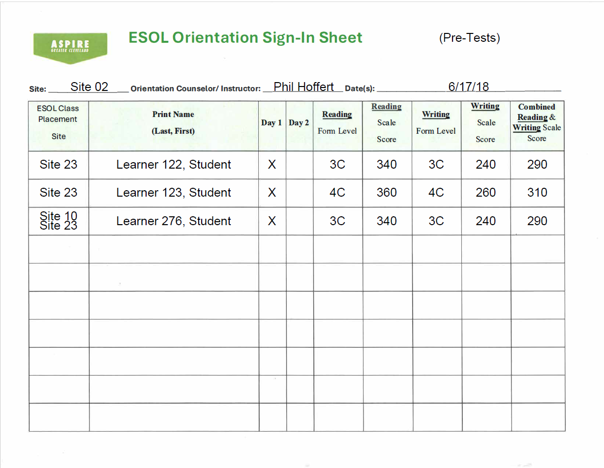](design/pngs/SRS_example_screenshots/orientation_sheet.png)

*Orientation sign-in and placement-testing report.*

[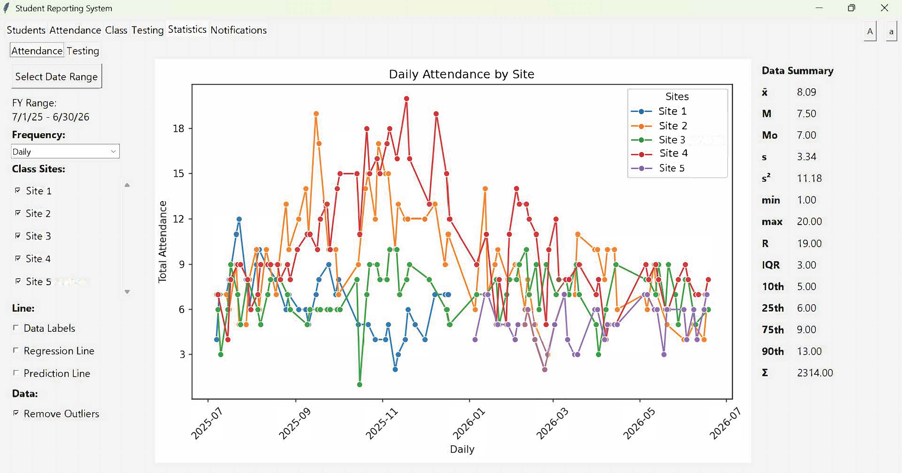](design/pngs/SRS_example_screenshots/attendance_stats.png)

*Attendance statistics dashboard with multi-site trend lines and summary measures.*

</details>

<details>
<summary><strong>Class notes and lesson planning</strong></summary>

[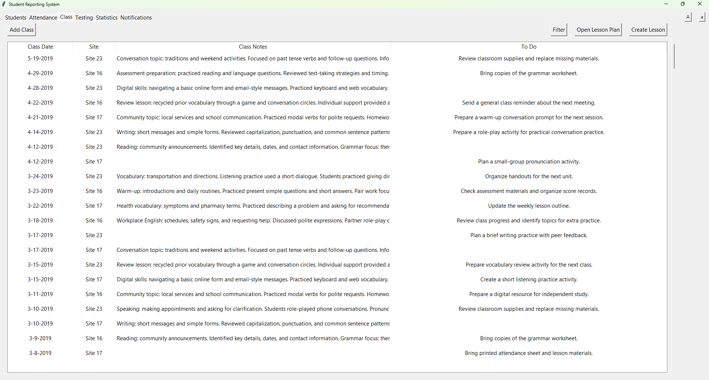](design/pngs/SRS_example_screenshots/class_notes.png)

*Class-notes workspace with instructional notes and follow-up tasks.*

[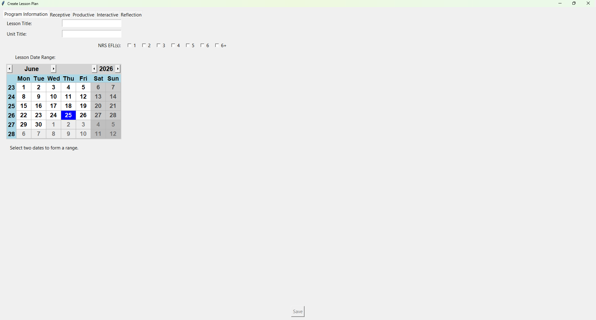](design/pngs/SRS_example_screenshots/lesson_plan_add_1.png)

*Lesson-plan creation workflow with title, unit, date range, and NRS EFL selection.*

[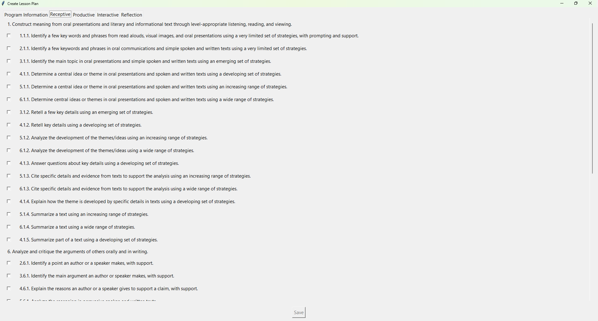](design/pngs/SRS_example_screenshots/lesson_plan_add_2.png)

*Standards-selection interface for aligning instruction to Ohio ESOL standards.*

[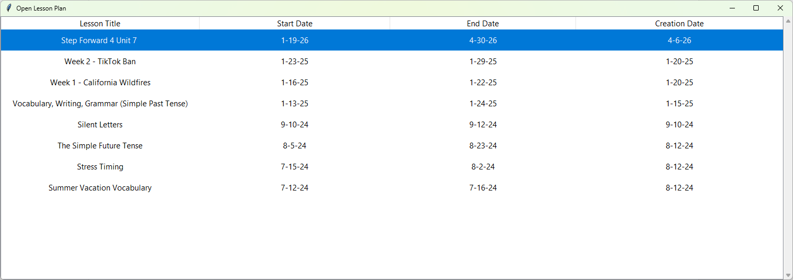](design/pngs/SRS_example_screenshots/lesson_plan_select.png)

*Saved lesson-plan library for reopening prior plans.*

</details>

## Application Areas

| Area | Purpose |
| --- | --- |
| **Students** | Demographics, contact information, site assignments, and individual student records |
| **Attendance** | Attendance entry and attendance history |
| **Class** | Class notes, instructional to-do items, and lesson-plan access |
| **Testing** | Assessment entry, answer-sheet grading, testing documentation, and outcomes |
| **Statistics** | Attendance and testing summaries |
| **Notifications** | Planned area for reminders and student follow-up |

Each student record includes dedicated views for demographics, attendance, individualized learning plans, meetings, and testing history.

## Technology

SRS is a local Python desktop application built with:

- Python
- Tkinter and ttk
- SQLite
- tkcalendar
- Pillow
- Matplotlib
- PyMuPDF
- pypdf
- ReportLab
- python-docx

## Project Structure

The application uses a SQLite database with related records for areas such as:

- `Student`
- `Sites`
- `StudentSites`
- `Attendance`
- `ILP`
- `Meetings`
- `Testing`

This design allows a student to be assigned to multiple sites while keeping attendance, assessment, and progress data connected to a single student record.

## Installation

### Requirements

Install Python 3.11 or later, then install the project dependencies:

```bash
pip install tkcalendar pillow matplotlib pymupdf pypdf reportlab python-docx psutil python-dateutil
```

### Run

From the project directory:

```bash
python main.py
```

## Data Privacy and Security

Because SRS may store sensitive educational records, follow these practices:

- Do not commit real student data to version control.
- Add database files, exported records, completed forms, and local configuration files to `.gitignore`.
- Use anonymized sample data for testing and demonstrations.
- Keep backups in secure, access-controlled locations.
- Follow all applicable organizational and legal requirements for student-data privacy.

## Project Status

SRS is an evolving practical tool built around the day-to-day administrative and instructional needs of a multi-site adult ESOL program. Features and workflows continue to be refined as reporting requirements and program practices change.

## Author

**Phil Hoffert**

Developed to support multi-site adult ESOL data management and reporting workflows.

## License

No open-source license has been selected for this repository yet. Until a license is added, all rights are reserved.

Before reusing, distributing, or adapting this project, obtain permission from the author and ensure that no student or program data is included.
